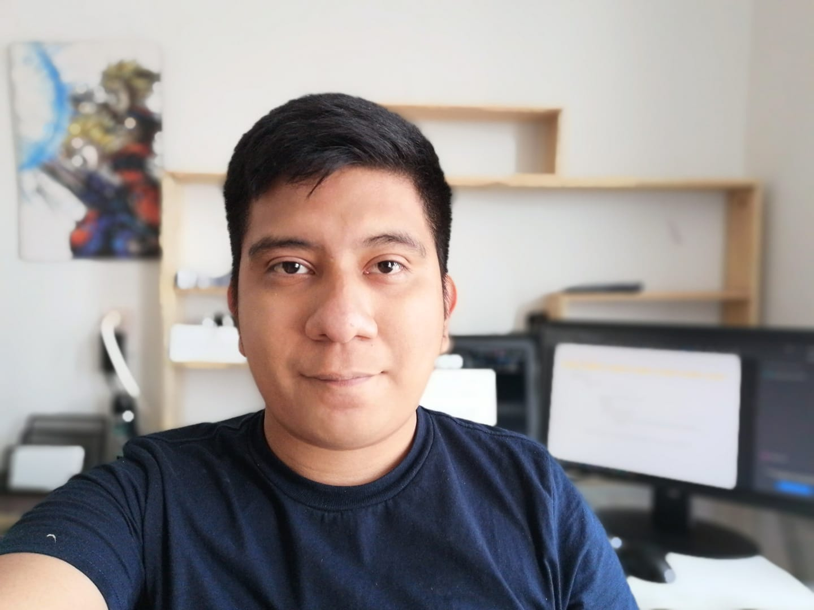

### Hi there 👋

My name is Cristhian Enrique Olivares Lara, I'm currently studying a master's degree in Applied Computing at LANIA.
I started in the programming since six years ago when I entered college. I've collaborated in projects about web sites, desktop applications and mobile apps.

### 🛠 &nbsp;Tech Stack

&nbsp;
&nbsp;
&nbsp;
&nbsp;
\
&nbsp;
&nbsp;
&nbsp;
&nbsp;
&nbsp;

## Connect with me:

 

<!--
**cristhianE2018/cristhianE2018** is a ✨ _special_ ✨ repository because its `README.md` (this file) appears on your GitHub profile.

Here are some ideas to get you started:

- 🔭 I’m currently working on ...
- 🌱 I’m currently learning ...
- 👯 I’m looking to collaborate on ...
- 🤔 I’m looking for help with ...
- 💬 Ask me about ...
- 📫 How to reach me: ...
- 😄 Pronouns: ...
- ⚡ Fun fact: ...
-->
